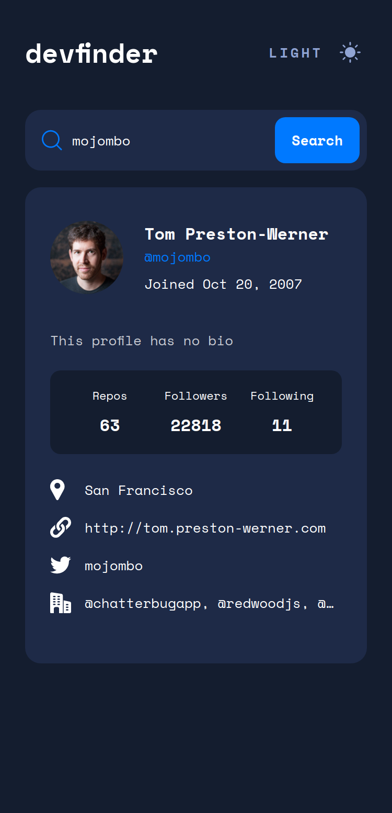
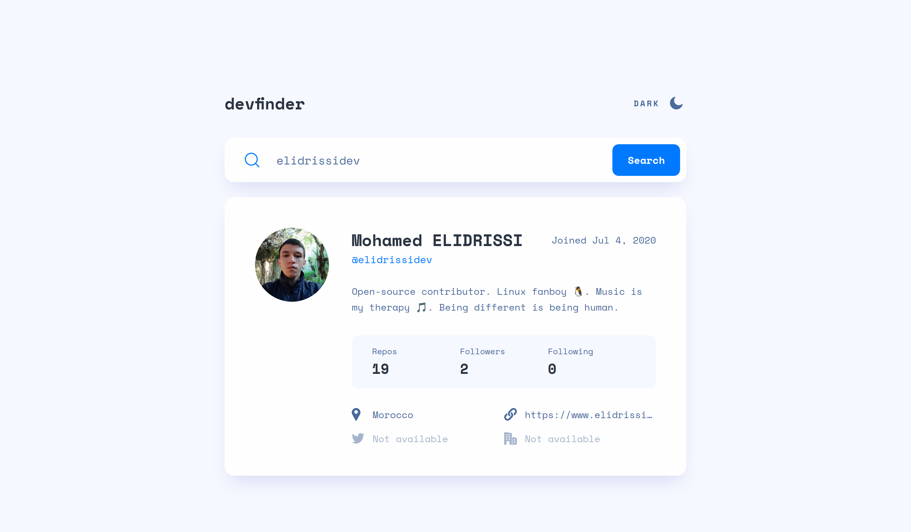

# Frontend Mentor - GitHub user search app solution

This is a solution to the [GitHub user search app challenge on Frontend Mentor](https://www.frontendmentor.io/challenges/github-user-search-app-Q09YOgaH6). Frontend Mentor challenges help you improve your coding skills by building realistic projects.

## Table of contents

- [Overview](#overview)
  - [The challenge](#the-challenge)
  - [Screenshot](#screenshot)
  - [Links](#links)
- [My process](#my-process)
  - [Built with](#built-with)
  - [What I learned](#what-i-learned)
  - [Continued development](#continued-development)
  - [Useful resources](#useful-resources)
- [Author](#author)
- [License](#license)

## Overview

### The challenge

Users should be able to:

- View the optimal layout for the app depending on their device's screen size
- See hover states for all interactive elements on the page
- Search for GitHub users by their username
- See relevant user information based on their search
- Switch between light and dark themes
- **Bonus**: Have the correct color scheme chosen for them based on their computer preferences. _Hint_: Research `prefers-color-scheme` in CSS.

### Screenshot

| Mobile (375px)                     | Desktop (1440px)                     |
| ---------------------------------- | ------------------------------------ |
|  |  |

### Links

- [Solution URL](https://github.com/elidrissidev/github-user-search)
- [Live Site URL](https://github-user-search-elidrissidev.vercel.app/)

## My process

### Built with

- Semantic HTML5 markup
- CSS custom properties
- Flexbox
- Mobile-first workflow
- [React](https://reactjs.org/) - JS library
- [React Testing Library](https://testing-library.com/docs/react-testing-library/intro) - Testing Library for React
- [Cypress](https://cypress.io/) - Front-end testing tool

### What I learned

This was my first attempt at building a modern React app, I learned how to take advantage of hooks to simplify and group functionality in one place, I also learned to stay away from state libraries at first and instead make use of the built-in `useState` hook and "lift the state up", which turned out to be enough for this specific app.

Another thing I struggled with a little is doing API requests, which seemed way easier at first, but I think I did a fine job at the end!

### Continued development

Working with React has been an interesting and fun experience, advancing my knowledge and building more complex apps is one thing I wanna focus on!

### Useful resources

- [React Testing Crash Course](https://www.youtube.com/watch?v=OVNjsIto9xM) - This helped me immensly as an introduction to testing React apps.

## Author

- Website - [Mohamed ELIDRISSI](https://www.elidrissi.dev)
- Frontend Mentor - [@elidrissidev](https://www.frontendmentor.io/profile/elidrissidev)
- Twitter - [@elidrissidev](https://www.twitter.com/elidrissidev)

## License

This project is licensed under the [MIT License](LICENSE.txt)
